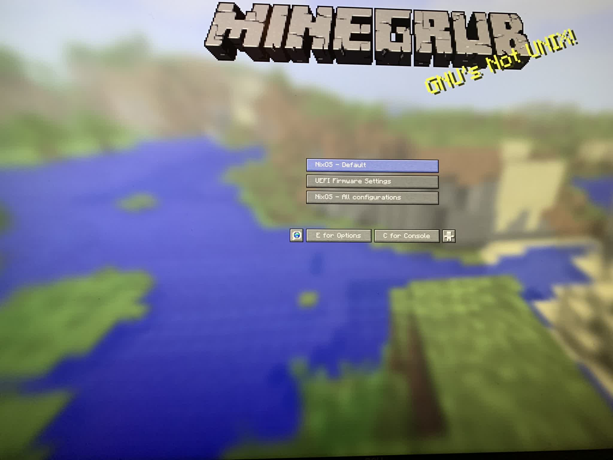

<h1 align="center">
  
   
  Interfiber's Dotfiles
   
  </img>
</h1>

## 📦 Contents

- [hosts](hosts) Modules for each host
  - [celeste](hosts/celeste) Module for celeste
    - [modules](hosts/celeste/modules) Home manager modules
    - [user](hosts/celeste/user) Home manager config
    - [configs](hosts/celeste/configs) Program configs
    - [system](hosts/celeste/system) NixOS configuration

## More screenshots

